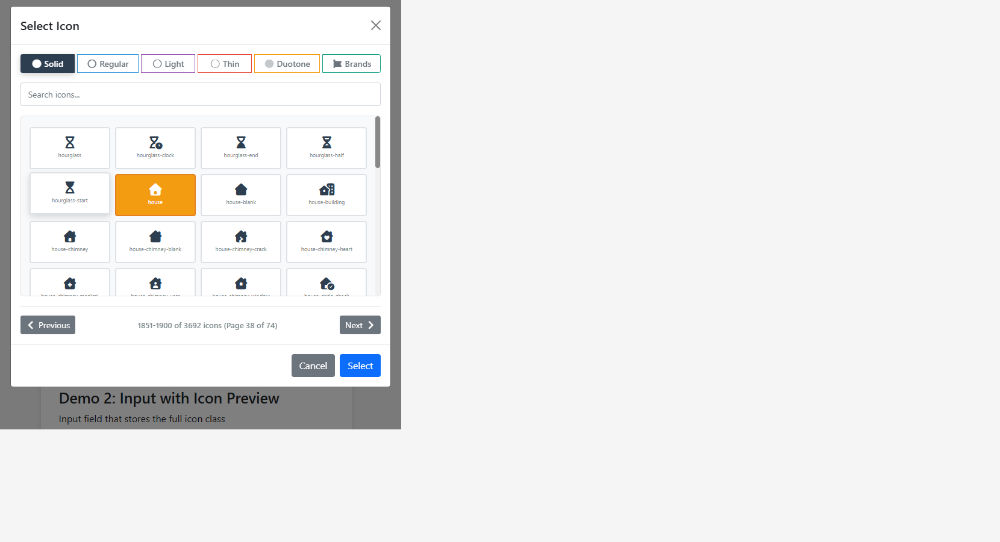

# MyRuns Icon Picker

Font Awesome 7 icon picker built with jQuery and Bootstrap modal UI.

It was extracted from MyRuns to work as a small standalone component and keeps a compatible API style with `bootstrap-iconpicker` for common use cases.

Based on `bootstrap-iconpicker v1.10.0` by [Victor Valencia Rico](https://github.com/victor-valencia).

Original project:

- Repository: https://github.com/victor-valencia/bootstrap-iconpicker
- Repository: [bootstrap-iconpicker](https://github.com/victor-valencia/bootstrap-iconpicker)
- Author: Victor Valencia Rico
- Original license: MIT

This version adapts that work for Font Awesome 7 and Bootstrap 5. Thanks to Victor Valencia Rico for the original component.

## Preview




## Features

- Font Awesome 7 dataset included as JSON metadata
- Family selector for `solid`, `regular`, `light`, `thin`, `duotone`, and `brands`
- Search by icon name, label, or search terms
- Paginated grid for fast rendering
- Works with buttons, links, inputs, and icon elements
- Supports multiple picker instances on the same page
- Auto-detects the local `data/fa7-icons.json` path by default

## Included Files

```text
css/
  myruns-iconpicker.css
data/
  fa7-icons.json
js/
  myruns-iconpicker.js
examples/
  basic.html
```

## Requirements

- jQuery 3.x
- Bootstrap 5 modal styles and JavaScript bundle
- Font Awesome 7 CSS

Important:

- This repository does not ship Font Awesome itself.
- Free families render with Font Awesome Free.
- `light`, `thin`, and `duotone` require a valid Font Awesome Pro license and assets.

## Quick Start

```html
<link rel="stylesheet" href="https://cdn.jsdelivr.net/npm/bootstrap@5.3.3/dist/css/bootstrap.min.css">
<link rel="stylesheet" href="./css/myruns-iconpicker.css">

<button id="iconPickerBtn" class="btn btn-primary">
  <i class="fa fa-solid fa-house"></i> Choose icon
</button>

<script src="https://code.jquery.com/jquery-3.7.1.min.js"></script>
<script src="https://cdn.jsdelivr.net/npm/bootstrap@5.3.3/dist/js/bootstrap.bundle.min.js"></script>
<script src="./js/myruns-iconpicker.js"></script>
<script>
  $('#iconPickerBtn').myrunsIconPicker({
    family: 'solid',
    icon: 'house'
  }).on('change', function (event) {
    console.log(event.icon, event.iconClass);
  });
</script>
```

## Input Example

```html
<div class="input-group">
  <input id="iconInput" class="form-control" value="fa fa-brands fa-github" readonly>
  <button id="iconInputBtn" class="btn btn-outline-secondary" type="button">Pick</button>
</div>

<script>
  const picker = new $.fn.myrunsIconPicker.Constructor($('#iconInput')[0], {
    family: 'brands',
    icon: 'github'
  });

  $('#iconInputBtn').on('click', function () {
    picker.show();
  });

  $('#iconInput').on('change', function (event) {
    console.log('Selected:', event.iconClass);
  });
</script>
```

## Options

| Option | Type | Default | Description |
| --- | --- | --- | --- |
| `family` | `string` | `solid` | Initial Font Awesome family |
| `icon` | `string` | `''` | Initial icon name or full class string |
| `rows` | `number` | `5` | Reserved compatibility option |
| `cols` | `number` | `10` | Reserved compatibility option |
| `search` | `boolean` | `true` | Shows the search input |
| `searchText` | `string` | `Search icons...` | Search placeholder |
| `selectedClass` | `string` | `btn-warning` | CSS class for selected icon button |
| `unselectedClass` | `string` | `btn-light` | CSS class for unselected icon buttons |
| `placement` | `string` | `bottom` | Reserved compatibility option |
| `title` | `string` | `Select Icon` | Modal title |
| `iconsPerPage` | `number` | `50` | Icons shown per page |
| `buttonClass` | `string` | `''` | Extra class added to button triggers |
| `dataUrl` | `string \| null` | `null` | Custom URL for `fa7-icons.json` |

## Public Methods

```js
$('#picker').myrunsIconPicker('show');
$('#picker').myrunsIconPicker('hide');
$('#picker').myrunsIconPicker('destroy');

const instance = $('#picker').data('myrunsiconpicker');
instance.setIcon('fa fa-brands fa-github');
console.log(instance.getIcon());
```

## Events

The component triggers a `change` event on the bound element.

```js
$('#picker').on('change', function (event) {
  console.log(event.icon);      // github
  console.log(event.iconClass); // fa fa-brands fa-github
});
```

## Notes

- `iconClass` already includes the leading `fa` class.
- If you pass a full class string to `setIcon()`, the picker detects the icon family automatically.
- When `dataUrl` is omitted, the plugin resolves `../data/fa7-icons.json` relative to the script file.

## Development

Open `examples/basic.html` in a local web server and point the Font Awesome stylesheet to your own assets.

## Credits

This project is derived from `bootstrap-iconpicker v1.10.0` created by Victor Valencia Rico.

- Original repository: [bootstrap-iconpicker](https://github.com/victor-valencia/bootstrap-iconpicker)
- Original author: Victor Valencia Rico
- Original license: MIT

MyRuns Icon Picker modernizes that base for Font Awesome 7, Bootstrap 5, and the MyRuns use case.

## License

This repository is currently distributed under GPL-3.0. See `LICENSE` for the current repository license.

Note: the upstream project `bootstrap-iconpicker` by Victor Valencia Rico was distributed under MIT.
